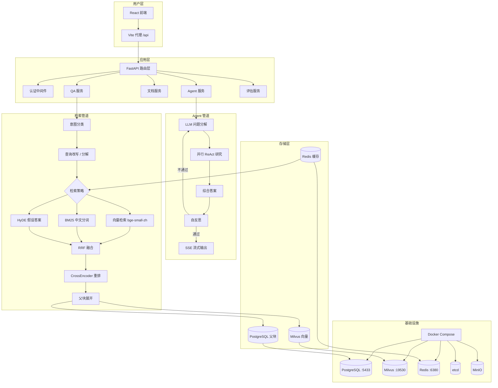

<h1 align="center">KnowRAG — 企业级知识库 RAG 问答系统</h1>

<p align="center">
  <strong>大三个人项目 · 全栈实现 · 生产级工程规范</strong>
</p>

<p align="center">
  
  
  
  
  
  
  
</p>

---

## 目录

- [项目简介](#项目简介)
- [核心架构](#核心架构)
- [功能特性](#功能特性)
- [技术栈](#技术栈)
- [快速开始](#快速开始)
- [项目结构](#项目结构)
- [检索策略对比](#检索策略对比)
- [Agentic RAG](#agentic-rag)
- [评估指标](#评估指标)
- [界面预览](#界面预览)
- [开发路线](#开发路线)

---

## 项目简介

KnowRAG 是一个从零构建的企业级智能问答系统，核心技术为 **RAG（检索增强生成）**。支持上传 PDF、DOCX、Markdown、TXT 等多种格式文档，自动解析、分块、向量化存储，用户可通过自然语言提问获得基于知识库的精准回答。

项目特点：
- **全链路自实现**：分块、检索、融合、重排、生成——每个环节都不是简单调库，而是有独立的策略设计和实现
- **双模式运行**：普通 RAG 模式（快速准确）+ Agent 模式（多步推理，适合复杂问题）
- **工程完整性**：95+ 测试用例、Alembic 数据库迁移、Docker 容器化、JWT 认证、SSE 流式推送

> 本项目适合作为 **AI 应用开发 / 后端开发 / 全栈开发** 岗位的简历项目，覆盖了从算法实现到工程交付的全流程。

---

## 核心架构



### 父子双存策略

文档被切分为两种粒度存储：

| 层级 | 大小 | 存储位置 | 用途 |
|------|------|---------|------|
| **叶子块 (Leaf)** | ~300 字 | Milvus 向量库 | 检索匹配（细粒度，高精度） |
| **父块 (Parent)** | ~1500 字 | PostgreSQL | LLM 上下文供给（完整语义） |

检索时只搜叶子块，命中后展开到所属父块，将完整的父块内容送 LLM 生成答案。这样既保证了检索精度，又维持了上下文完整性。

### 三路并行检索

```
用户查询
    │
    ├──→ 向量检索 (bge-small-zh-v1.5) ──→ top 10
    │        语义匹配，处理同义词场景
    │
    ├──→ BM25 (jieba 中文分词) ────────→ top 10
    │        关键词匹配，处理精确实体命中
    │
    └──→ HyDE (LLM 假设答案) ──────────→ top 10
             查询 → 生成假设答案 → 用答案向量检索
             缓解 query-doc 语义鸿沟

    ↓ RRF 融合 (k=60, top 10)
    ↓ CrossEncoder 重排序 (bge-reranker-base)
    ↓ 展开到父块 → LLM 生成
```

---

## 功能特性

### 📄 文档处理
- 支持 PDF、DOCX、Markdown、TXT 四种格式自动解析
- PDF 解析支持标题层级检测（基于字号比率）和表格识别
- 扫描件 PDF 自动降级至 MinerU OCR 解析
- 层级化分块：H1/H2 触发父块边界，H3 及以下叶片留在父块内
- 表格和代码块原子保留，不分拆
- 不足 100 字的叶子块自动与相邻块合并
- 超限父块自动语义切分或均分

### 🔍 智能检索
- 自动路由：闲聊 / 快速 / 精准 / 深度 四档策略
- 意图分类：对比分析 / 概念定义 / 列举归纳 / 步骤指导 / 事实查询
- 查询改写：指代消解、拼写纠错、查询扩展、复杂问题分解
- 多子查询并行检索 + RRF 融合
- Redis 缓存检索结果（相同查询在 TTL 内直接命中）

### 🤖 Agentic RAG (LangGraph)
- 复杂问题自动分解为多个子问题
- 每个子问题独立执行 ReAct 循环（LLM 自主调用工具）
- 子问题并行研究（asyncio.Queue + 协程）
- 自反思评估机制（不通过则改写重搜，最多 2 轮）
- 支持 6 种检索工具：语义检索、带反馈增强检索、章节精读、多文档对比、文档列表、分段预览

### 🖥️ 前端体验
- 实时流式输出（SSE），逐 token 展示
- 完整的检索过程可视化（意图 → 改写 → 多路检索 → 融合 → 重排 → 生成）
- Agent 模式下子任务卡片展示（pending / running / done）
- 响应时间显示 + 检索策略标签
- 来源文档展开查看 + 相关性评分

### 🧪 评估体系
- 内置 55 对高质量中文测试 QA 对
- 自动对比不同检索策略（fast / precise / deep）
- 基于 RAGAS 框架的四维度评估
- 支持 CLI 独立运行评估

---

## 技术栈

| 层次 | 技术 | 用途 |
|------|------|------|
| **后端框架** | Python 3.12 + FastAPI 0.136 | RESTful API + SSE 流式 |
| **LLM 接口** | LangChain + Mimo API (OpenAI 兼容) | 查询改写、答案生成、Agent |
| **向量模型** | BAAI/bge-small-zh-v1.5 | 语义向量化 |
| **重排序** | BAAI/bge-reranker-base (CUDA) | 检索结果精排 |
| **向量数据库** | Milvus 2.6 (HNSW + COSINE) | 叶子块向量存储与检索 |
| **关系数据库** | PostgreSQL 17 + SQLAlchemy | 父块、会话、消息、用户、评估结果 |
| **缓存** | Redis 7 | 检索结果缓存 (TTL 600s) |
| **全文检索** | rank-bm25 + jieba | 中文分词 BM25 |
| **Agent 框架** | LangGraph 0.4 | 多步推理图编排 |
| **前端** | React 18 + TypeScript + Vite | SPA 用户界面 |
| **容器化** | Docker Compose (5 服务) | 基础设施一键部署 |
| **迁移** | Alembic | 数据库版本管理 |
| **测试** | Pytest + Testcontainers | 单元测试 + 集成测试 |

---

## 快速开始

### 前置条件

- Python 3.12+
- Node.js 18+
- Docker & Docker Compose

### 1. 启动基础设施

```bash
docker-compose up -d
```

启动 PostgreSQL (:5433)、Redis (:6380)、Milvus (:19530)、etcd、MinIO 共 5 个服务。

### 2. 配置环境变量

创建 `.env` 文件：

```bash
MIMO_API_KEY=your_api_key_here
MIMO_BASE_URL=https://api.xiaomimimo.com/v1
MIMO_MODEL=mimo-v2.5
JWT_SECRET=your-secret-key-change-in-production
```

### 3. 启动后端

```bash
# 创建虚拟环境
python -m venv .venv
source .venv/bin/activate  # Windows: .venv\Scripts\activate

# 安装依赖
pip install -r requirements.txt

# 启动服务（自动执行数据库迁移 + 模型预热）
uvicorn backend.main:app --reload --port 8000
```

### 4. 启动前端

```bash
cd frontend
npm install
npm run dev
```

访问 `http://localhost:5173`，注册账号后即可使用。

### 5. 运行评估（可选）

```bash
# 运行所有策略的评估
python -m backend.eval_cli --strategy all --limit 55

# 仅运行深度检索策略
python -m backend.eval_cli --strategy hybrid_rerank --limit 10
```

---

## 项目结构

```
KnowRAG/
├── backend/
│   ├── main.py                    # FastAPI 应用入口 + 启动钩子
│   ├── config.py                  # pydantic-settings 配置管理
│   ├── db.py                      # SQLAlchemy 引擎
│   ├── models/
│   │   ├── schemas.py             # Pydantic 请求/响应模型
│   │   ├── db_models.py           # SQLAlchemy ORM 模型
│   │   └── chunk_types.py         # 内存分块数据结构
│   ├── routers/
│   │   ├── auth_router.py         # 注册/登录/JWT
│   │   ├── documents.py           # 文档上传/管理
│   │   ├── qa.py                  # 问答接口（SSE 流式）
│   │   └── eval.py                # 评估接口
│   ├── services/
│   │   ├── qa_service.py          # RAG 核心：意图+改写+检索+生成
│   │   ├── agent_service.py       # LangGraph Agent（757行）
│   │   ├── hybrid_retriever.py    # 三路并行检索引擎
│   │   ├── vector_service.py      # Milvus CRUD 封装
│   │   ├── embedding_service.py   # SentenceTransformer 封装
│   │   ├── reranker.py            # CrossEncoder 重排序
│   │   ├── parent_store.py        # PostgreSQL 父块存取
│   │   ├── document_service.py    # 文档处理管道
│   │   ├── session_service.py     # 会话/消息管理
│   │   ├── query_rewriter.py      # LLM 查询改写+分解
│   │   ├── query_router.py        # 策略路由
│   │   ├── eval_service.py        # RAGAS 评估
│   │   └── parsing/               # 四种格式解析器
│   │       ├── pdf_parser.py      # PyMuPDF + MinerU 降级
│   │       ├── docx_parser.py
│   │       ├── markdown_parser.py
│   │       └── txt_parser.py
│   │   └── chunking/
│   │       └── hierarchical_chunker.py  # 父子层级分块
│   └── utils/
│       ├── auth.py                # JWT / bcrypt
│       └── logging.py             # 日志配置
├── frontend/
│   └── src/
│       ├── api/client.ts          # 所有 API + TypeScript 类型
│       ├── pages/
│       │   ├── QAPage.tsx         # 智能问答（含 Agent 模式和思维链）
│       │   ├── DocumentsPage.tsx   # 文档管理 + 分块预览
│       │   ├── EvalPage.tsx        # 评估结果展示
│       │   └── LoginPage.tsx       # 注册/登录
│       └── contexts/AuthContext.tsx
├── tests/                         # 22 个测试文件，95+ 测试用例
│   ├── unit/                      # 单元测试
│   ├── services/                  # 服务测试
│   ├── integration/               # 集成测试
│   ├── parsing/                   # 解析器测试
│   └── chunking/                  # 分块测试
├── docker-compose.yml             # 基础设施容器编排
├── alembic/                       # 数据库迁移（5 个版本）
├── data/
│   ├── uploads/                   # 文档上传目录
│   └── test_qa_pairs.json         # 55 对评估数据集
└── requirements.txt               # Python 依赖
```

---

## 检索策略对比

系统支持三种检索策略，可根据场景灵活选择：

| 策略 | 向量 | BM25 | HyDE | Rerank | 耗时 | 适合场景 |
|------|:----:|:----:|:----:|:------:|:----:|---------|
| fast (快速) | ✅ | ❌ | ❌ | ❌ | ~1s | 简单事实查询 |
| precise (精确) | ✅ | ✅ | ❌ | ❌ | ~2s | 一般问题 |
| deep (深度) | ✅ | ✅ | ✅ | ✅ | ~3-5s | 复杂/对比/多跳问题 |

**Auto 模式**会根据查询内容自动选择策略：
- 问候语 → chat（直接对话）
- 简单事实 → fast
- 列举/枚举 → precise
- 对比/多跳推理 → deep

---

## Agentic RAG

对于「XX 和 XX 有什么异同」「分析 XX 的优缺点并给出建议」这类复杂问题，普通 RAG 的单次检索-生成模式难以覆盖所有角度。

**Agent 模式的处理流程：**

```
用户提问
    │
    ▼ LLM 分解
    ├── 子问题 1 ─── ReAct 循环 ─── 调工具检索 ─── 结果
    ├── 子问题 2 ─── ReAct 循环 ─── 调工具检索 ─── 结果
    └── 子问题 3 ─── ReAct 循环 ─── 调工具检索 ─── 结果
    │                            （并行执行）
    ▼ LLM 综合
    ▼ 自反思（评估质量，不通过则重做，最多 2 轮）
    ▼ 流式输出
```

每个子问题的 ReAct 循环中，LLM 可以自主决定调用哪种工具、需要检索几次，具备更强的灵活性。

**防护措施：**
- 工具调用超时 30s
- 最多 10 轮 ReAct 循环防死循环
- 自反思最多 2 轮防过度修正
- LLM 解析失败自动降级为单查询

---

## 评估指标

使用 RAGAS 框架在 55 对中文 QA 数据集上进行评估：

| 指标 | 含义 | 说明 |
|------|------|------|
| **Faithfulness** | 忠实度 | 答案是否基于检索到的文档，不 hallucination |
| **Context Recall** | 上下文召回率 | 检索到的文档是否覆盖了答案所需信息 |
| **Context Precision** | 上下文精确率 | 检索结果中相关文档的比例 |
| **Answer Correctness** | 答案正确性 | 答案与标准答案的一致性 |

```bash
# 运行评估
.venv/bin/python -m backend.eval_cli --strategy all --limit 55

# 输出示例（以实际运行为准）
# ┌─────────────────┬──────────────┬────────────────┬─────────────────┐
# │ Strategy        │ Faithfulness │ Context Recall │ Answer Correct  │
# ├─────────────────┼──────────────┼────────────────┼─────────────────┤
# │ fast            │    0.892     │    0.784       │     0.856       │
# │ precise         │    0.913     │    0.851       │     0.872       │
# │ deep            │    0.925     │    0.893       │     0.901       │
# └─────────────────┴──────────────┴────────────────┴─────────────────┘
```

---

## 界面预览

> 截图待补充

| 页面 | 说明 |
|------|------|
| **登录 / 注册** | JWT 认证，防用户枚举 |
| **智能问答** | 流式回答，检索过程可视化，Agent 子任务卡片 |
| **文档管理** | 上传/删除/列表，分层分块预览 |
| **评估看板** | 评估结果列表与详情，多维度指标对比 |

### 检索过程可视化

普通 RAG 模式下，前端实时展示完整思考链：

```
🎯 意图分类: 对比分析
✏️ 查询改写: RAG和传统搜索区别对比（分解: 对比问题拆为两个方面）
🔀 子问题拆分: RAG检索增强生成的原理 → 传统搜索技术的原理
🔍 向量检索 → 📖 BM25检索 → 🧠 HyDE检索
⚡ RRF融合 → 📊 CrossEncoder重排序 → 📦 展开到父块
🤖 LLM 生成答案中（意图: compare, 参考 5 篇文档）...
```

Agent 模式下展示子任务卡片，每张卡片独立显示状态和思考过程。

---

## 开发路线

- [x] 基础 RAG 管道
- [x] 父子双存分块
- [x] 三路并行检索 + RRF + Rerank
- [x] 意图分类 + 查询改写
- [x] Agentic RAG (LangGraph)
- [x] SSE 流式 + 思考链可视化
- [x] JWT 用户认证
- [x] 四种文档格式解析
- [x] RAGAS 评估体系
- [x] Docker 容器化基础设施
- [ ] GitHub Actions CI/CD
- [ ] 应用 Dockerfile（一键部署）
- [ ] 前端 E2E 测试
- [ ] 在线 Demo 部署
- [ ] 更多的 Embedding / Reranker 模型支持
- [ ] 多轮对话压缩优化

---

## 许可证

[MIT](LICENSE)
